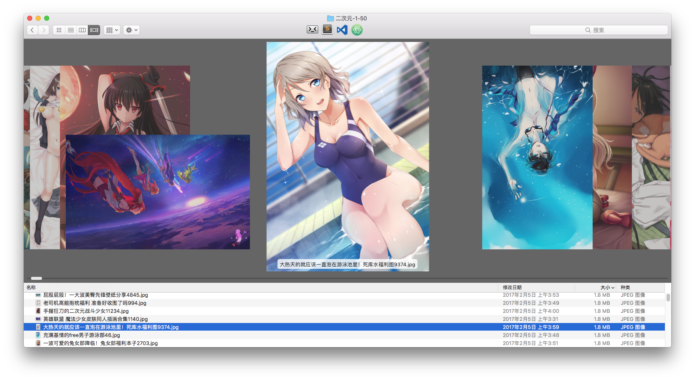
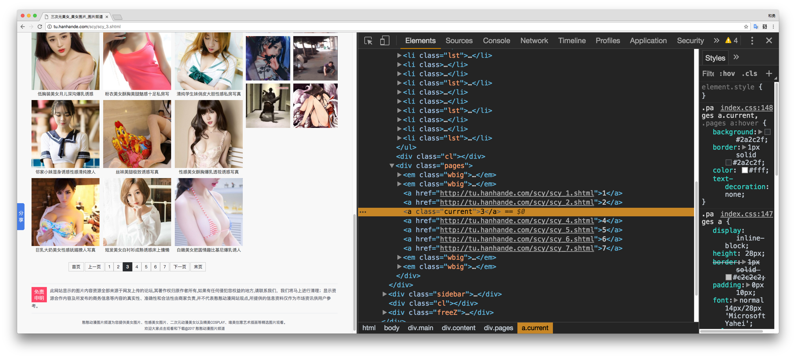
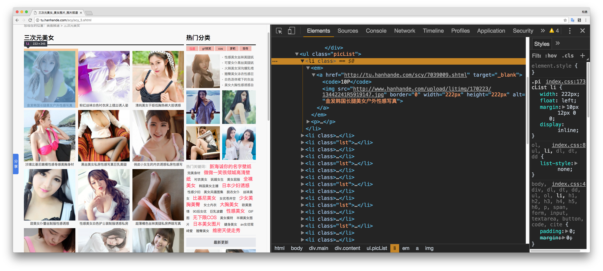
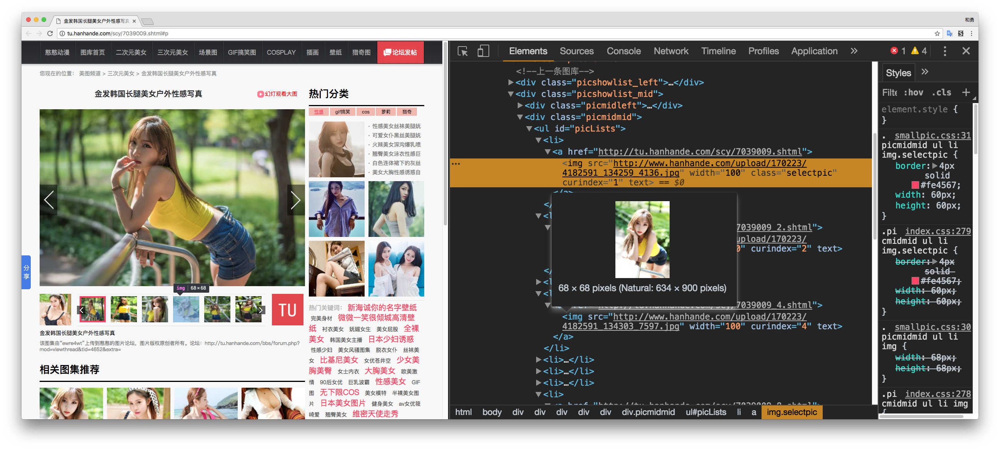

那天晚上，打完LOL后，电脑右下角弹出了一个小框:"超越完美比例的诱惑 LOL大尺度同人手绘"
。点开网站后不仅有二次元，还有三次元和Cosplay，年轻气盛气血方刚的我大呼过瘾，一口气看了十几个图册后，我觉得一页只能看一张老是要点下一页然后网页重新渲染再下一张好烦啊，于是四处找爬虫教程写了个爬虫把这网站图都爬下来了。现在我可以用鼠标滚轮滚着看。

## 使用的库
```javascript
  "dependencies": {
    "async": "^2.1.4",//并发控制库
    "cheerio": "^0.22.0",//node.js端的jquery
    "superagent": "^3.4.1",//http请求下载
    "superagent-charset": "^1.1.1"//superagent GBK支持
  }
  ```
## 页面分析
### 页码分析
以三次元图片为例，首先分析页码结构，可以看到图册的页码非常有规律，例如第2页，URL是：[http://tu.hanhande.com/scy/scy_2.shtml](http://tu.hanhande.com/scy/scy_2.shtml)（点走了可以，记得回来看代码），不同页码就是数字不一样。只要改变数字就是不同的页码。

### 图册获取
获取页码之后开始获取每个图册的URL，可以看到每页的所有图册都在 class 为 .picList的ul元素里面的li元素里面。图册地址就是a标签的Herf属性，图册标题是img元素的alt属性。这样所有页面的所有图册信息就获取到了。

以下是获取指定范围页面所有画册的代码：
```javascript
let getAlbumsAsync = function () {
    return new Promise(function (resolve, reject) {
        console.log('Start get albums .....');
        let albums = [];
        let q = async.queue(function (url, callback) {
            request.get(url).charset('gbk')
                .end(function (err, res) {
                    if (err) {
                        console.log('err: ' + err);
                    } else {
                        let $ = cheerio.load(res.text);
                        $('.picList em a').each(function (idx, element) {
                            albums.push({
                                title: element.children[1].attribs.alt,
                                url: element.attribs.href,
                                imgList: []
                            });
                        });
                    }
                    callback();
                });
        }, 10);//html下载并发数设为10
        /**
         * 监听：当所有任务都执行完以后，将调用该函数
         */
        q.drain = function () {
            console.log('Get album complete');
            //返回所有画册
            resolve(albums);
        }

        let pageUrls = [];
        let imageTypeUrl = AllImgType[Config.currentImgType];
        for (let i = Config.startPage; i <= Config.endPage; i++) {
            pageUrls.push(imageTypeUrl + i + '.shtml');
        }
        q.push(pageUrls);
    }
    );
}

```
### 图册图片列表
获取到图册的地址后，需要获取到图册里面所有图片的URL,进入图册URL查看图册，分析发现图册里面的所有图片都在ID为picLists的UL元素中，图片的URL就是img元素的SRC属性，而且图片列表中加载的都是原图，不是缩略图，只是通过css缩放了。可以看到图片的原始尺寸是634*900 pixels.这样，每个图册里面的所有图片地址也获取到了。

以下是获取所有图册的所有图片URL代码：
```javascript
let getImageListAsync = function (albumsList) {
    return new Promise(function (resolve, reject) {
        console.log('Start get album`s imgList ....');
        let q = async.queue(function (album, callback) {
            console.log('Get image list : ' + album.title);
            request.get(album.url).charset('gbk')
                .end(function (err, res) {
                    if (err) {
                        console.log('err: ' + err);
                    } else {
                        let $ = cheerio.load(res.text);
                        $('#picLists img').each(function (idx, element) {
                            album.imgList.push(element.attribs.src);
                        });
                    }
                    callback();
                });
        }, 10);//html下载并发数设为10
        /**
         * 监听：当所有任务都执行完以后，将调用该函数
         */
        q.drain = function () {
            resolve(albumsList);
        }

        //将所有任务加入队列
        q.push(albumsList);
    });
}
```
### 图片保存到电脑
当所有图册的所有图片URL都下载完成后，将所有图片下载到电脑上。

```javascript
function downloadImg(albumList) {
    console.log('Start get album`s imgList ....');
    let folder = `Data/img-${Config.currentImgType}-${Config.startPage}-${Config.endPage}`;
    fs.mkdirSync(folder);
    let downloadCount = 0;
    let q = async.queue(function (image, callback) {
        console.log('正在下载 : ' + image.title);
        request.get(image.url).end(function (err, res) {
            if (err) {
                console.log(err);
                callback(null);
            } else {
                downloadCount++;
                fs.writeFile(`./${folder}/${image.title}-${downloadCount}.jpg`, res.body, function (err) {
                    if (err) {
                        console.log(err);
                    } else {
                        console.log("图片下载成功");
                    }
                    callback(null);
                });
            }
        });
    }, Config.downloadConcurrent);//图片下载并发为Config.downloadConcurrent
    /**
     * 监听：当所有任务都执行完以后，将调用该函数
     */
    q.drain = function () {
        console.log('All img download');
    }
    let imgList = [];
    albumList.forEach(function (album) {
        album.imgList.forEach(function (imgUrl) {
            imgList.push({ title: album.title, url: imgUrl });
        });
    });
    q.push(imgList);//将所有任务加入队列
}
```

### 代码运行
由于使用了Async Await,需要Node.js 7.5及以上版本
```
$ git clone https://github.com/nieheyong/hanhandeSpider.git
$ cd hanhandeSpider
$ npm install
$ npm start
```

完整代码查看 [https://github.com/nieheyong/hanhandeSpider/blob/master/app.js](https://github.com/nieheyong/hanhandeSpider/blob/master/app.js)